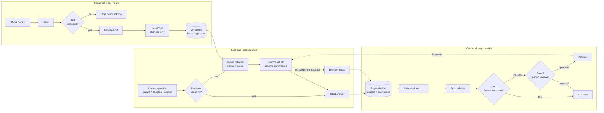
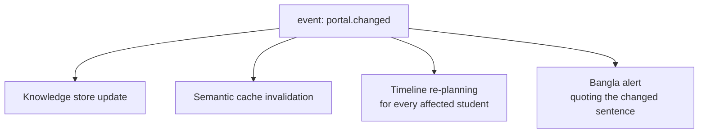
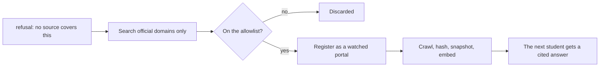
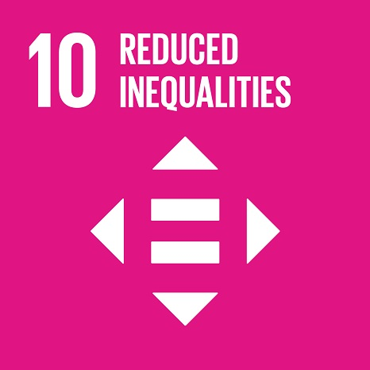

<div align="center">

# দিগন্ত · Digonto

**A free, Bangla-first Study Abroad and Visa Navigator, powered by Gemma 4 E2B.**

*Digonto is the Bangla word for horizon.*

[](https://kaggle.com/competitions/build-with-gemma-bangladesh)
[](https://kaggle.com/competitions/build-with-gemma-bangladesh)
[](https://ollama.com/library/gemma4)
[](LICENSE)
[](docs/business_model.md)

</div>

---

A student in Rangpur or Barishal should be able to plan an international
education without paying a consultancy firm a semester's worth of tuition for
advice that is often wrong. That is the entire purpose of this project.

**Live:** https://digonto.ahbab.dev · **Competition:**
[Build With Gemma @ Bangladesh](https://kaggle.com/competitions/build-with-gemma-bangladesh)

---

## For judges: sign in here

Two accounts are seeded with realistic data, so nothing has to be created before
the product does something. Sign in at
[digonto.ahbab.dev/auth](https://digonto.ahbab.dev/auth). Email and password
only, no confirmation email, no one-time code.

| Role | Email | Password |
| --- | --- | --- |
| **Student** | `judge@digonto.ahbab.dev` | `DigontoJudge2026!` |
| **Reviewer** | `moderator@digonto.ahbab.dev` | `DigontoMod2026!` |

The student account arrives with a profile, three shortlisted programmes, six
vault documents, a plan already in progress, answered questions with citations,
and one completed interview. The reviewer account opens on a queue with real
pending work in it.

**The fastest way to see what this is, in about ninety seconds:**

1. **Ask Digonto** — ask `যুক্তরাজ্যে পড়তে কত টাকা ব্যাংকে দেখাতে হবে?` (how much
   must I show in the bank to study in the UK). Then click a citation marker in
   the answer. The panel that opens shows the archived source page with the
   quoted sentence highlighted and the timestamp it was captured.
2. **Ask something no source covers.** It refuses and says which portals it is
   watching, instead of inventing a number. That behaviour is the point of the
   system, not a limitation of it. The refusal is also a trigger: it sends Porter
   looking for the official page that would have answered, so the same question
   is answerable next time. A refusal is the system noticing a gap, not shrugging
   at one.
3. **Journey Planner** — press *Simulate a portal change*. A step re-plans, the
   dependent steps move with it, and the drawer explains what changed and cites
   the source. The response is labelled `simulated` so it is never mistaken for
   a real embassy change.
4. **Document Vault** — upload any PDF or photo. Prohori audits it against the
   real checklist and reports what is missing, expiring, or inconsistent.
5. **Sign in as the reviewer** and open the change queue. A portal change the
   model classified with low confidence is waiting for a human before any
   student is alerted.

> These two accounts exist for judging. They are seeded only when `APP_ENV` is
> not `production`, every row they create carries `is_demo = 1`, and
> `python run.py --reset` wipes and rebuilds them. Change both passwords in
> `.env` before this deployment is used by real students, since anything
> published in a public README should be treated as public.

---

## The problem, in verified numbers

Every figure was checked against its source on 26 July 2026. Full citations with
DOIs are in [`docs/paper/references.bib`](docs/paper/references.bib).

| | |
|---|---|
| **52,799** | Bangladeshi students studying abroad in 2023, across 55 countries. Roughly three times the number fifteen years earlier. |
| **$667.77M** | Left the country for overseas education in FY25 alone, through 109,290 banking transactions. A record for a single year. |
| **Hundreds** | Consultancy firms operating in Bangladesh, with no mandatory registration system for this specific sector. Most run on a general trade licence with no specialised supervision. |
| **54.90%** | Schengen visa refusal rate for Bangladeshi applicants in 2024: 20,957 refusals out of 39,345 applications, up from 42.8% in 2023. Every refusal also costs a non-refundable fee. |
| **~65%** | Of applications from India and Bangladesh to one United States university found likely fraudulent, much of it traced to agents. |

The information a student needs is already public. It is also written in dense
administrative English, spread across dozens of portals, and revised without
announcement. Digonto reads those portals so the student does not have to, and
answers in clear Bangla with a citation for every claim.

## What Digonto is not

Not a chatbot with a knowledge base attached. The conversational surface is one
page out of twelve. The value comes from automation: 31 official portals are
crawled and diffed on a schedule, changes become events, events update a versioned
knowledge store, agents act on the student's behalf, and the model itself improves
from real corrections behind two promotion gates.

The watch list is not a fixed list either. The crawler follows links inside each
source, and a question nobody could answer sends it searching for the official
page that would answer it. Search is constrained to an allowlist of government,
embassy, university, and named-scholarship domains, and nothing it finds is ever
shown to the model directly: a search result contributes a URL, which is crawled
and snapshotted like any other source before it can be cited. Aggregators, forums
and consultancy pages are excluded outright, since those are the confidently-wrong
sources this exists to replace.

---

## Architecture: Recurrent Continual RAG (RC-RAG)

Three loops of different speed around one Gemma 4 E2B model. The design principle
is a separation of duties by timescale: facts that change daily live in a
versioned retrieval store, and skills that improve slowly live in the model
weights.



**Why both loops.** Retrieval handles fact turnover well but cannot improve how
clearly the model explains a solvency rule in Bangla. Fine-tuning improves that
skill but is a poor carrier of facts that change weekly. Each mechanism
compensates for a specific weakness of the other. Full treatment in
[`docs/paper/`](docs/paper/).

### One event, four consumers

This is the specific reason the backend is event-driven rather than
request-driven.



And the reverse edge, which is what stops a refusal being a dead end:



---

## Why Gemma 4 E2B

Verified against the running install with `ollama show gemma4:e2b`:

| Property | Value |
|---|---|
| Effective parameters | 2.3B (5.1B total, Per-Layer Embeddings) |
| Context length | 131,072 tokens |
| Capabilities | completion, **vision**, **audio**, **tools**, thinking |
| Licence | Apache 2.0 |

Native **vision** reads uploaded transcripts, bank statements, and refusal
letters, directly, with no separate OCR service. Native **tool calling** is
verified against the live model and backs three reusable MCP servers; the
seven agents themselves ask the model for one schema-constrained structured
reply each instead of calling a tool, so there is no hand-written parser over
free text either way. Native **audio** is a model capability this deployment
has not wired up yet: voice input is planned, and today the interview room
accepts typed answers only, because no speech-to-text service is deployed.
One model, one runtime, for everything that is built.

It fits in the memory of a modest virtual machine, which decides two things that
matter more than benchmark scores: student passports never leave our own server,
and the marginal cost of an answer is close to the electricity cost of a machine
we already rent. That is what makes "free, permanently" a plan rather than a
promise.

---

## Seven Gemma agents

Specifications, tool schemas, and MCP servers in [`agents.md`](agents.md).

| Agent | Role |
|---|---|
| **পোর্টার** Porter | Watches 31 official portals. Classifies each change, discards wording-only edits, alerts affected students with the changed passage quoted and cited. Grows its own watch list: it follows links inside a source, and when a question has no answer it searches for the official page that would answer it. |
| **প্রহরী** Prohori | Audits the document vault against each target's real checklist. Flags missing, expiring, and inconsistent documents, and drafts request letters. |
| **খোঁজি** Khoji | Matches the profile against a funding index, with a reason for every criterion, and builds a complete budget including the bank balance the embassy actually requires. |
| **সঞ্চারী** Shonchari | Runs mock visa interviews conditioned on the student's own file, scoring answers for consistency with their documents, which is what a visa officer checks. |
| **বিচারক** Bicharok | Reads an actual refusal letter with vision, maps each ground to the rule it cites, and says in Bangla whether it is remediable and how. |
| **লেখক** Lekhok | Compares a statement of purpose against the student's own documents and reports contradictions, unsupported claims, and vague passages. |
| **দলিল** Dalil | Reads a consultancy contract clause by clause and reports which terms are ordinary and which transfer risk onto the student. |

The last three exist because more than half of Bangladeshi Schengen applications
were refused in 2024. The second attempt matters as much as the first, and a
student who cannot read the refusal cannot correct it.

## Four features beyond the brief

1. **Visa Timeline Reactor** — a plan that re-plans itself. When an IELTS date
   slips or an embassy changes a rule, every dependent step is recomputed and the
   student is told exactly what moved and why.
2. **Truth Ledger** — every claim links to a timestamped snapshot of the source
   page. A student can show a bank officer where a requirement came from. The
   verification page is public and needs no account.
3. **Agent Fee Reality Check** — enter a consultancy quote, get it itemised into
   free services, fixed official fees, and a fair residual, each line cited.
4. **Rejection Autopsy** — upload a refusal letter and get a remediation plan
   mapped to the specific rules cited, written in Bangla.

---

## Two stakeholders

**Students** get everything above, free, permanently.

**Reviewers** hold the three decisions that should not be automated:

- A portal change classified below the confidence threshold reaches nobody until
  a human confirms it. A false "your deadline moved" alert to five hundred
  students is worse than a slow one.
- A corrected answer is recorded by a human, not inferred from a thumbs-down.
  That correction is the highest-value item in the training buffer.
- No model adapter reaches students on the automatic benchmark alone.

**Reviewers cannot read student documents.** They hold no key material and there
is no code path from a reviewer route to vault contents. Every reviewer access to
student-linked data is logged and shown to that student. See
[`docs/api_contract.md`](docs/api_contract.md) section 11a.

---

## Run it

```bash
git clone https://github.com/MdAhbab/Digonto.git
cd Digonto
python3 run.py
```

`run.py` checks Python and Node versions, reports whether Redis, Qdrant and
Ollama are reachable with the exact command to start each, verifies the model
reports native tool support, generates per-machine secrets, vendors the
webfonts, installs both dependency trees, applies migrations, seeds accounts,
and starts the API and web client together.

| Flag | Effect |
|---|---|
| `--check` | run every check and exit without starting anything |
| `--skip-install` | fast restart, do not touch pip or npm |
| `--reset` | delete local databases and re-seed |
| `--backend-only` / `--frontend-only` | run one side |

Prerequisites: Python 3.12 or 3.13, Node 20+, and `ollama pull gemma4:e2b`.

Python 3.14 does not work yet, and `run.py` now says so immediately rather than
failing partway through the install. The pinned `pydantic-core` has no wheel for
3.14, and building it from source fails because its bundled PyO3 supports up to
3.13. The deployed image pins `python:3.12-slim`, so this affects local runs only.

### Deploy

```bash
sudo python3 run_onVM.py --domain digonto.ahbab.dev --email you@example.com
```

Takes a fresh Ubuntu VM to a TLS deployment: verifies DNS actually points at the
machine before calling certbot, installs Docker from Docker's own repository,
configures nginx (with proxy buffering off on the streaming routes), obtains and
auto-renews the certificate, and hardens with ufw, fail2ban, and unattended
security updates. Idempotent; re-running is the intended way to redeploy.

---

## Repository layout

```
Digonto/
├── run.py                     one command from clone to running
├── run_onVM.py                one command from bare VM to TLS deployment
├── docker-compose.prod.yml    api, worker, ollama, redis, qdrant, backup
├── backend/
│   ├── app/                   FastAPI, MVC, event-driven
│   │   ├── models/            Pydantic contracts
│   │   ├── repositories/      data access, parameterised SQL only
│   │   ├── services/          business logic, emits events
│   │   ├── routers/           thin HTTP layer
│   │   ├── agents/            the seven Gemma agents
│   │   ├── events/            Redis Streams bus, idempotent consumers
│   │   ├── llm/               model routing
│   │   └── db/migrations/     numbered SQL, checksum-verified
│   └── backend.md             engineering plan
├── frontend/                  React 18 + Vite + Tailwind + Three.js + GSAP
├── docs/
│   ├── database.md            full schema, ~45 tables
│   ├── api_contract.md        every endpoint, mapped to the page it serves
│   ├── business_model.md      sustainability, SDG, ethics, security
│   ├── seo.md                 indexing policy, honest about the SPA limitation
│   ├── video_script.md        the demo video, shot by shot
│   ├── notebook_plan.md       the public reproducible notebook
│   ├── submission_checklist.md
│   └── paper/                 IEEE paper (LaTeX, untracked)
└── paper/
    ├── research_paper.md      readable mirror of the paper
    └── kaggle_writeup.md      competition writeup
```

---

## Sustainable Development Goals

<div align="center">




</div>

| Goal | Target | How Digonto contributes |
|---|---|---|
| **4** Quality Education | 4.3, 4.b | Equal access to affordable tertiary education, and making existing scholarships findable rather than assumed. |
| **8** Decent Work | 8.8 | Reducing extraction by unregistered intermediaries keeps family savings in productive use. |
| **10** Reduced Inequalities | **10.7** | Orderly, safe, and responsible migration. Accurate, cited visa information reduces both exploitation and refusal-by-misinformation. |
| **16** Strong Institutions | 16.10 | Public access to information. The Truth Ledger republishes official information verifiably, with provenance. |

*SDG icons © United Nations. Used for informational purposes in line with UN
guidelines. The United Nations does not endorse this project.*

## Responsibility

**Ethics.** Sourced information, never legal advice, and the interface says so.
The system refuses rather than guesses on visa-critical questions, and the
refusal is enforced by a database constraint and an output schema, not by prompt
wording. Shonchari coaches truthful presentation only and refuses requests to
misrepresent facts, explaining the legal consequences of visa fraud.

**Privacy and security.** Inference is self-hosted, so passports and bank
statements never leave the deployment. Vault files are encrypted at rest with a
per-document random key, itself wrapped with a per-user key derived by HKDF from
the deployment secret, so one user's wrapping key cannot open another's documents. The training buffer physically cannot store unconsented or
un-scrubbed data: it is a `CHECK` constraint, not a policy. Full export and hard
delete, with deletion cascading to files.

**Human-centred design.** Bangla first, not Bangla translated. Voice input for
users more comfortable speaking than typing. Every technical term explained at
first use. Design validated with students from at least three districts outside
Dhaka rather than assumed.

Details and the threat model: [`docs/business_model.md`](docs/business_model.md)
and [`backend/backend.md`](backend/backend.md).

## Free for students, sustainable anyway

Free for every student, permanently. Revenue comes from institutions, never from
students: university partnership listings, verified-consultancy certification, an
institutional API, and grants. What is never sold: student data, answer
placement, or referrals. Full model in
[`docs/business_model.md`](docs/business_model.md).

## Licence

Project code under Apache-2.0. Gemma 4 is used under the Apache 2.0 licence.
